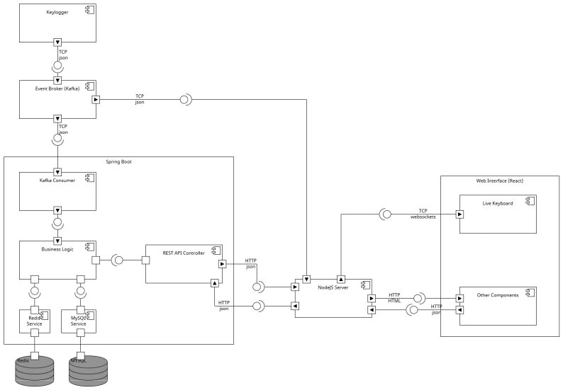

# Project abstract

## Title: *KeyUsageProfiler*

## Description

An app that tracks the usage of keys in a keyboard while giving some users statistics about them in intuitive ways.
Allows for monitoring of multiple users running a keylogger by a team leader. Also detects inactivity and improper activity (such as gaming in work hours) and alerts the team leader about it.

Made for the IES course on school year 23/24

## Project Team

*Team Manager* - Miguel Pinto <miguel.silva48@ua.pt>

*Product Owner* - Ricardo Quintaneiro <ricardoquintaneiro@ua.pt>

*DevOps* - Miguel Figueiredo <miguel.belchior@ua.pt>

*Architect* - João Dourado <joao.dourado1@ua.pt>

## How to run

```bash
# clone repository locally
git clone git@github.com:miguel-silva48/KeyUsageProfiler.git; 
cd KeyUsageProfiler;
```

### Running the App

Make sure you have [Docker Compose](https://docs.docker.com/engine/install/) installed.

Uses the following *Docker* images:

- [`mysql:5.7`](https://hub.docker.com/layers/library/mysql/5.7/images/sha256-dab0a802b44617303694fb17d166501de279c3031ddeb28c56ecf7fcab5ef0da?context=explore) - persistence DB
- [`redis:alpine`](https://hub.docker.com/layers/library/redis/alpine/images/sha256-20d2c28fbf8ec97b9ad6eab187d6252b730bf16219c612b77897eb28bab3526f?context=explore) - cache/short-lived data DB
- [`rabbitmq:management`](https://hub.docker.com/layers/library/rabbitmq/management/images/sha256-4e1247e3ae79f16e74df87eea3070f71256e2d5ed770ef0a4bc3f55a30527a1b?context=explore) - message queue
- [`maven:3-openjdk-17`](https://hub.docker.com/layers/library/maven/3-openjdk-17/images/sha256-62e6a9e10fb57f3019adeea481339c999930e7363f2468d1f51a7c0be4bca26d?context=explore) - for running spring framework
- [`node:18-alpine`](https://hub.docker.com/layers/library/node/18-alpine/images/sha256-8842b060b01af71c082cee310b428a2d825e940d9fd9e450e05d726aea66a480?context=explore) - for running the frontend web application

```bash
docker compose up -d;     # create docker containers
```

Access the frontend at <http://localhost:5173/>. <br>
There is also a [.env](.env) file that you may edit if you chose to change some of the environmental variables.

### Running Keylogger Sensor

Make sure you have both [Maven](https://maven.apache.org/install.html) and [Java 17+](https://openjdk.org/install/) installed. Furthermore, make sure you edit the **USER_ID** in the [.env](projSensor/keylogger_sensor/.env) file to the database id of the user you want to impersonate when producing the keystrokes:

```bash
USER_ID=1
RABBITMQ_HOST="localhost"
```

Running directly (make sure to provide the USER_ID argument):

```bash
cd projSensor/keylogger_sensor/;
mvn package;
mvn exec:java -Dexec.mainClass="com.mibef108287.app.App";
```

Packaging into a JAR and running (make sure to provide the USER_ID argument):

```bash
cd projSensor/keylogger_sensor/;
mvn package;
java -jar target/keylogger_sensor-1.0-SNAPSHOT-jar-with-dependencies.jar;
```

## Architecture Diagram



## Bookmarks

### Management Board

An overall view of the user stories and their status can be found in the following link:

<https://github.com/users/miguel-silva48/projects/1>

### Cloud versions of reports and others

Project_Specification_Report:

<https://docs.google.com/document/d/1QzRJoO-oqjjJ1CPPHerlChldXcHeHqTO6yjKa63GLKo/edit>

Prototype (Figma):

<https://www.figma.com/file/obImDvzy220l7wHxBSFWRW/KeyUsageProfiler?type=design&node-id=0%3A1&mode=design&t=VuI7D2o2buKyOZtO-1>

Presentation:

<https://uapt33090-my.sharepoint.com/:p:/g/personal/miguel_belchior_ua_pt/Ef_fPynL-OtFpRP8IDC1Vl4BPzEYnji-qqcrNiqj78ujZA?e=t7rEqO>

### Entry point to the API documentation

While running the backend service, access the following endpoint:
[http://localhost:8080/swagger-ui/index.html#/](http://localhost:8080/swagger-ui/index.html#/)
